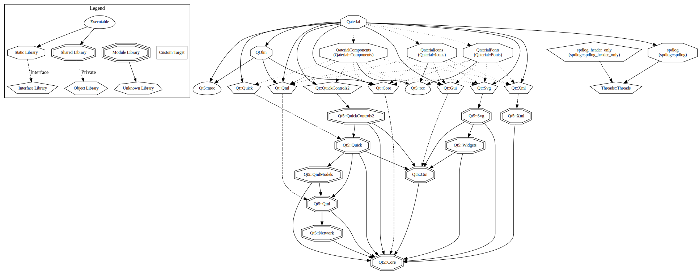

# Qaterial

 

A collection Material Components to build faster UI using Qml. 

> Warning : If you intend to use Qaterial in your project, you should use a stable version (v1.3) or create your own fork. I'm using this library for my own projects, and I will introduce breaking change if needed.
> This library isn't meant for LTS. Use at your own risk.

Feel free to pull request.

## 🚀 Overview

- Checkout [Qaterial Gallery](https://olivierldff.github.io/QaterialGallery/) for example of most components.
- [Getting Start Guide](https://olivierldff.github.io/Qaterial/Quickstart.html).
- Try it live with [Qaterial Online](https://olivierldff.github.io/QaterialOnline/) (and checkout examples).

## Roadmap

Some history. I started this library as a way to learn qml and how controls work. I made some api mistake so i'm fixing them here and there as time go. There will be breaking change.

### Breaking Change

My goal is to move to more standard API relying more only on QtQuickControls default property. I think i made the mistake to introduce some property in type that doesn't need to be there. Here are some idea where i'm going:

- [x] Move to Material 2018 text type. (Deprecate Material 2014 text type)
- [x] Deprecate `textType` to only use `font` that is present in every controls. (Already in master)
  Now you can use `Label.Headline6` for example where you used `textType: Qaterial.Style.TextType.Title`. Or `font: Qaterial.Style.textTheme.headline6`.
- [ ] Deprecate `onPrimary`, `colorReverse`, etc... that are everywhere
- [ ] Introduce a `ColorTheme` for base color of every controls.
- [ ] Use `palette` introduced in Qt 5.13 as the way to change colors to every controls. This will deprecate `foregroundColor`, `backgroundColor`, etc ... in many controls.
- [ ] Use attached properties for custom properties (ie elevation) as qt recommend in documentation.
- [ ] `TextField ` will become a simple control without decorator meant to be the base of more customizable controls. You should move to `TextFieldFilled` or `TextFieldOutlined` or `TextField2014` to have decorator (icon, suffix, prefix, etc...) (TextField2014 is already available as it is TextField).
  Maybe introduce a `TextFieldDecorated` without any background.
  Also maybe use `placeholderText` instead of `title`. Since title is used as placeholder from my experience.
- [ ] ColorPicker (i think it will be multiple variant and building block since everyone wants a different color picker).
- [ ] Deprecate some components llike `DoublePage` that are too much specialized and are not controls.
- [ ] Change name of `FabButton` to `FloatingActionButton`.
- [ ] Clean the mess of `RawMaterialButton`.
- [ ] Base `TextArea` on `T.TextArea` and not `Item`.
- [ ] More example in general.
- [ ] Deprecate TabBar specialization that are too much specialized that i end up never using them. They would better fit as example.
- [ ] Deprecate `RoundColorIcon` that is too complicated to use (and maintain)
- [ ] Refactor `RoundImage` to use `ClipRRect`.

### Missing Components (ideas)

- [ ] AppBar (today only called ToolBar)
- [ ] Avatar
- [ ] Badge
- [ ] Backdrop
- [ ] Breadcrumb
- [ ] Chips
- [ ] Navigation rail
- [ ] Bottom sheets
- [ ] SearchBar

## 📌 Dependencies

* [QOlm](https://github.com/OlivierLDff/QOlm)
* `Qt::Core`, `Qt::Gui`, `Qt::Qml`, `Qt::Quick`, `Qt::QuickControls2`, `Qt::Svg`, `Qt::Xml`
* [googlefonts](https://github.com/OlivierLDff/fonts)
* [MaterialDesignIcons](https://github.com/OlivierLDff/MaterialDesignSvgo)

