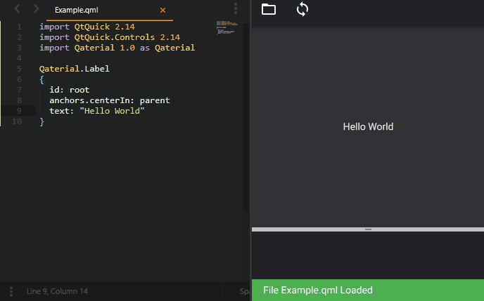
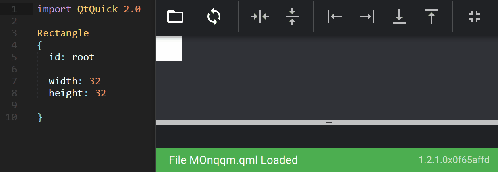

# ♨️ Qaterial Hot Reload

**QaterialHotReload** is an app that load a `.qml` file, and reloads it each time the file is saved on the system.



## Position anchors

Helpers button can apply anchors to your qml object.



* FullScreen: `anchors.fill: parent`
* Horizontal Center: `anchors.horizontalCenter: parent.horizontalCenter`
* Vertical Center: `anchors.verticalCenter: parent.verticalCenter`
* Left: `anchors.left: parent.left`
* Right: `anchors.right: parent.right`
* Bottom: `anchors.bottom: parent.bottom`
* Top: `anchors.top: parent.top`

## Build & Execute

Add the flag `-DQATERIAL_ENABLE_TOOLS=ON` when configuring the project with cmake to create the executable.

``` bash
cmake -DQATERIAL_ENABLE_TOOLS=ON ..
cmake --build . --target QaterialHotReload
./tools/HotReload/QaterialHotReload
```